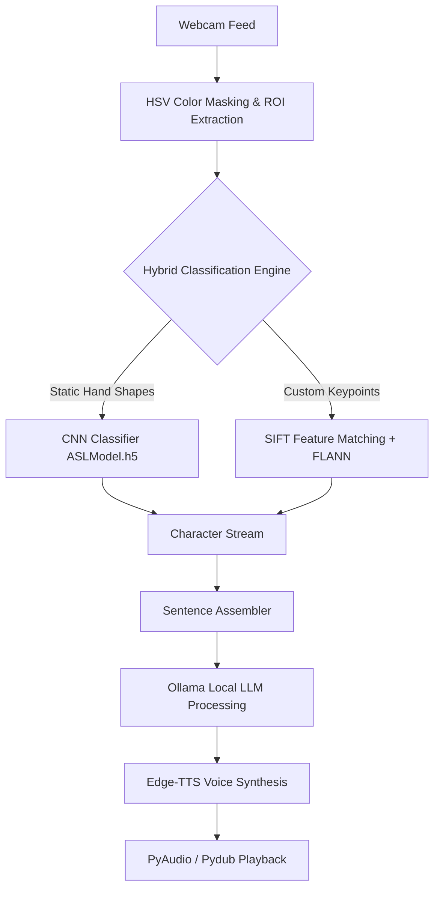

# Rabbit-SignLink: Sign Language Learning & Recognition Assistant (NaVin AIF)

## 📺 Demo / Screenshots

| Version connected with LLM | Legacy video demo |
|:---:|:---:|
|  <br> [Open Local Image](file:///C:/Users/navin/Downloads/NV942/NV942/demo/demo.png) | <video src="demo/old_video_demo.mp4" width="380" controls></video> <br> [Open Local Video](file:///C:/Users/navin/Downloads/NV942/NV942/demo/old_video_demo.mp4) |

---

Rabbit-SignLink is a research-oriented assistant application designed for real-time sign language recognition (specifically American Sign Language - ASL) and interactive learning. The system proposes a hybrid framework that translates raw camera-captured hand gestures into readable text, contextually processes them using an offline Large Language Model (LLM), and synthesizes interactive speech responses.

> [!IMPORTANT]
> **PROJECT STATUS & ACADEMIC NOTICE**
>
> * **For Academic & Research Community:** This project was originally designed as an open-source research initiative to explore accessibility solutions for the deaf and hard-of-hearing community.
> * **Archived Status (Stopped):** The project is officially archived and no longer actively developed. The core dependencies (legacy Keras/TensorFlow versions) may be outdated.
> * **Archiving Purpose:** All current updates and configurations are maintained solely for **archival, historical preservation, and academic reference**.

---

## 🔬 System Architecture & Research Pipeline

The project implements a multi-stage pipeline combining traditional computer vision, deep learning, local natural language processing (NLP), and speech synthesis.



### 1. Preprocessing & Hand Region Extraction (ROI)
* **Color Space Masking:** The webcam feed is processed in the **HSV** color space. A predefined mask filters skin tones (`lower_skin = [0, 20, 70]`, `upper_skin = [20, 255, 255]`) to isolate the hand region from background noise.
* **Region of Interest (ROI):** A bounding rectangle maps the hand region, resizing it to `64x64` pixels before feeding it into the recognition engines.

### 2. Hybrid Sign Recognition Engine
To achieve robust and high-accuracy results, the application utilizes a dual-path classification approach:
* **Deep Learning Path (CNN):** A custom Convolutional Neural Network (implemented via Keras) classifies static hand shapes into 26 ASL alphabet categories (`ASLModel.h5`).
* **Feature Keypoint Path (SIFT + FLANN):** 
  - **SIFT (Scale-Invariant Feature Transform):** Detects scale- and rotation-invariant keypoints within the cropped hand image.
  - **FLANN (Fast Library for Approximate Nearest Neighbors):** Matches SIFT descriptors against templates stored in the `SampleGestures/` directory. This is utilized for custom gestures (e.g., Space characters `sp`).

### 3. Asynchronous PyQt5 Multi-threading
To prevent UI freezing during real-time image processing and model inference, the application separates execution into multiple threads:
* **Video Capture Thread:** Runs on a background daemon thread (`threading.Thread(daemon=True)`) to capture frames from OpenCV, apply SIFT/CNN predictions, and refresh the UI frame label.
* **Progress Thread (`QThread`):** Runs an asynchronous learning timer, tracking whether the recognized hand gesture matches the tutorial gesture and updating the progress bar via thread-safe **PyQt Signals** (`countChanged.emit(count)`).

### 4. Local LLM & Voice Synthesis Pipeline
* **Contextual NLP Inference:** Once characters are assembled into a sentence, the text is fed to a local instance of **Ollama** using the `ollama` library. This offline LLM handles spelling correction, context analysis, and dialogue generation.
* **Audio Synthesis:** The LLM's text output is converted to high-quality audio bytes asynchronously using **Edge-TTS** (Microsoft Edge Text-to-Speech API).
* **Playback Pipeline:** **Pydub** decodes the audio stream and **PyAudio** streams the audio output to the user's audio devices.

---

## 🛠️ Technology Stack & Requirements

This application runs on **Python 3.11** under Windows:

* **GUI Framework:** PyQt5 (Dynamic UI compilation from `.ui` files).
* **Computer Vision:** OpenCV-Python (`cv2`), NumPy.
* **Deep Learning Framework:** TensorFlow, `tf-keras` (Keras 3.x backward-compatibility wrapper).
* **Local Language Model:** `ollama`.
* **Speech & Audio:** `edge-tts`, `pydub`, `pyaudio`.
* **Database & Hashing:** `mysql-connector-python`, `bcrypt` (secure salted password hashing).

---

## ⚙️ Installation & Running

### 1. Install Dependencies
Open your command terminal (PowerShell / Command Prompt) and run:
```bash
pip install tensorflow tf-keras PyQt5 opencv-python mysql-connector-python bcrypt ollama edge-tts pydub pyaudio
```

### 2. Windows DLL & Keras 3 Patches
* **DLL Load Order:** On Windows, importing `PyQt5` before `tensorflow` causes a conflict in the C-runtime libraries. The codebase has been patched to import `tensorflow` **first** in both [main.py](file:///C:/Users/navin/Downloads/NV942/NV942/main.py) and [LearnActivity.py](file:///C:/Users/navin/Downloads/NV942/NV942/LearnActivity.py).
* **Keras 3 Wrapper:** The legacy model is loaded using `tf_keras.models.load_model` to resolve backward-compatibility crashes.
* **MySQL Bypass:** If a local MySQL server is not active on port 3306, the login window will automatically bypass authentication to allow quick GUI evaluation.

### 3. Launch the Application
Run the main file:
```bash
python main.py
```

---

## 📁 Project Directory Structure

```text
├── main.py                # Main entry point (Rabbit-SignLink GUI & Asynchronous Loops)
├── LearnActivity.py       # Asynchronous Tutorial & Learning GUI Handler
├── test.py                # Isolated OpenCV webcam SIFT/CNN testing script
├── ai_process.py          # Local LLM (Ollama) and Speech (Edge-TTS) controller
├── auth_check.py          # Relational Database authentication check
├── pyqt_UI/               # XML GUI files (.ui) designed via Qt Designer
│   └── last_ui_rabbit.ui  # Main application dashboard layout
├── auth_app/              # Sign-In & Registration layouts (.ui)
├── models/                # Trained deep learning models
│   └── ASLModel.h5        # CNN pre-trained weight parameters (26 classes)
├── demo/                  # Demo assets (demo.png, old_video_demo.mp4)
├── deprecated/            # Archived legacy files (ai.py, small_ai.py, etc.)
└── SampleGestures/        # SIFT template images for keypoint matching
```

---

## 🤝 License & Academic Citations

This repository is distributed as an **open academic resource**. You are free to fork, modify, and integrate this pipeline into modern gesture recognition architectures (e.g., using PyTorch or MediaPipe).
