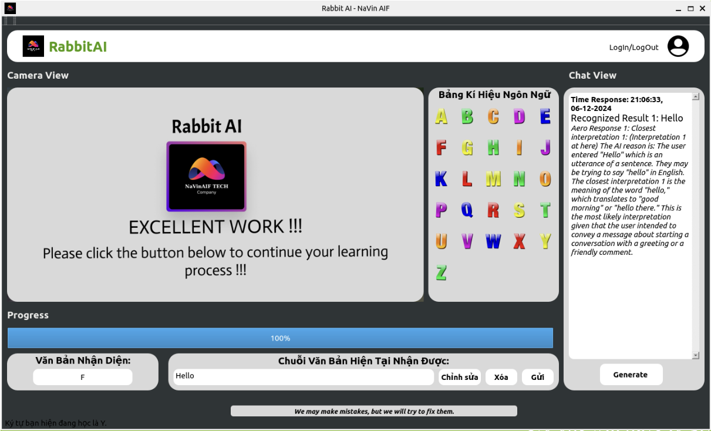
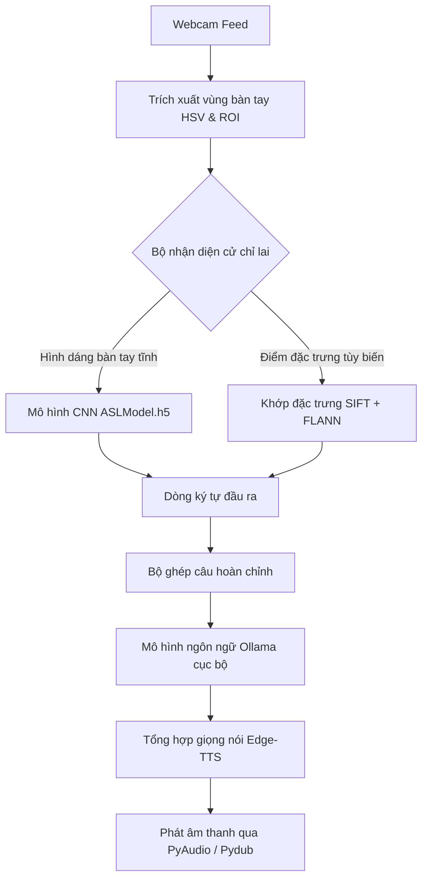

# Rabbit-SignLink: Trình học tập & Nhận diện ngôn ngữ ký hiệu (NaVin AIF)

### 🖼️ Phiên bản được kết nối với LLM


### 🎥 Video demo cũ
<video src="demo/demo_small.mp4" width="100%" controls></video>
[Xem video demo cũ](demo/demo_small.mp4)

---

Rabbit-SignLink là một ứng dụng hỗ trợ học tập và nhận diện ngôn ngữ ký hiệu thời gian thực (đặc biệt là bảng chữ cái ngôn ngữ ký hiệu Mỹ - ASL) định hướng nghiên cứu học thuật. Hệ thống đề xuất một khung làm việc lai (hybrid), chuyển đổi các cử chỉ tay thu được từ camera thành chuỗi ký tự, xử lý ngữ cảnh hóa thông qua mô hình ngôn ngữ lớn (LLM) chạy ngoại tuyến và tổng hợp phản hồi giọng nói tương tác.

> [!IMPORTANT]
> **THÔNG BÁO VỀ TÌNH TRẠNG DỰ ÁN & HỌC THUẬT**
>
> * **Vì cộng đồng nghiên cứu & học thuật:** Dự án được thiết kế ban đầu dưới dạng sáng kiến nghiên cứu mã nguồn mở nhằm khám phá giải pháp công nghệ hỗ trợ cộng đồng người khuyết tật và khiếm thính.
> * **Trạng thái lưu trữ (Archived):** Dự án hiện đã ngừng phát triển chính thức. Các thư viện cốt lõi (TensorFlow/Keras phiên bản cũ) có thể không còn tương thích hoàn toàn với các phần mềm hiện đại nếu không có cấu hình đặc biệt.
> * **Mục đích duy trì:** Mọi nỗ lực cập nhật, vá lỗi và chạy thử ở thời điểm hiện tại chỉ nhằm mục đích **lưu trữ lịch sử, bảo tồn tài nguyên khoa học và làm tài liệu tham khảo cho cộng đồng học thuật**.

---

## 🔬 Kiến trúc hệ thống & Quy trình xử lý (Research Pipeline)

Dự án triển khai một quy trình xử lý đa giai đoạn (pipeline) kết hợp giữa thị giác máy tính truyền thống, học sâu (deep learning), xử lý ngôn ngữ tự nhiên (NLP) cục bộ và tổng hợp giọng nói.



### 1. Tiền xử lý & Trích xuất vùng bàn tay (ROI)
* **Phân ngưỡng không gian màu (Color Masking):** Luồng hình ảnh từ webcam được chuyển đổi sang không gian màu **HSV**. Một bộ lọc màu da (`lower_skin = [0, 20, 70]`, `upper_skin = [20, 255, 255]`) được áp dụng để cô lập vùng bàn tay khỏi nền nhiễu phía sau.
* **Vùng quan tâm (ROI):** Xác định khung bounding box chứa bàn tay và thực hiện co giãn về kích thước tiêu chuẩn `64x64` pixel trước khi truyền vào bộ nhận diện.

### 2. Bộ nhận diện cử chỉ lai (Hybrid Recognition Engine)
Để đạt được độ chính xác và tính linh hoạt tối đa, hệ thống áp dụng cơ chế nhận diện song song:
* **Nhánh Học sâu (CNN Path):** Sử dụng mạng nơ-ron tích chập (CNN) xây dựng trên Keras để phân loại hình dáng bàn tay tĩnh thành 26 chữ cái Alphabet ngôn ngữ ký hiệu (`ASLModel.h5`).
* **Nhánh Khớp điểm đặc trưng (SIFT + FLANN):** 
  - **SIFT (Scale-Invariant Feature Transform):** Trích xuất các điểm đặc trưng không biến đổi theo tỷ lệ và góc quay từ vùng bàn tay cắt ra.
  - **FLANN (Fast Library for Approximate Nearest Neighbors):** Khớp các vector đặc trưng SIFT thu được với các mẫu ảnh cử chỉ tĩnh định sẵn trong thư mục `SampleGestures/` (Ví dụ: ký tự khoảng trắng `sp`).

### 3. Cơ chế xử lý đa luồng bất đồng bộ PyQt5
Để tránh gây đóng băng giao diện đồ họa (UI Freeze) trong quá trình xử lý hình ảnh và chạy mô hình học sâu thời gian thực:
* **Luồng camera (Video Capture Thread):** Chạy trên một luồng nền Daemon (`threading.Thread(daemon=True)`) chuyên biệt, thực hiện việc lấy khung hình từ OpenCV, chạy dự báo SIFT/CNN và cập nhật dữ liệu điểm ảnh lên giao diện.
* **Luồng tiến trình học (`QThread`):** Sử dụng lớp luồng riêng biệt của PyQt kết hợp với cơ chế truyền phát tín hiệu an toàn luồng (**PyQt Signals** - `countChanged.emit(count)`) để cập nhật thanh tiến trình học tập mà không gây cản trở luồng giao diện chính.

### 4. Quy trình LLM & Tổng hợp giọng nói cục bộ (Offline NLP & Speech)
* **Suy luận ngữ cảnh NLP:** Chuỗi các ký tự ghép lại được chuyển đến mô hình ngôn ngữ lớn chạy cục bộ qua thư viện `ollama`. Mô hình thực hiện sửa lỗi chính tả, phân tích ngữ nghĩa và tạo ra câu trả lời hội thoại tương ứng.
* **Tổng hợp giọng đọc:** Câu trả lời văn bản được chuyển đổi bất đồng bộ thành luồng âm thanh thông qua API **Edge-TTS** (Microsoft Edge Text-to-Speech).
* **Phát âm thanh:** Sử dụng **Pydub** để giải mã và **PyAudio** để truyền phát dữ liệu âm thanh trực tiếp đến thiết bị loa của người dùng.

---

## 🛠️ Công nghệ & Thư viện sử dụng

Ứng dụng hoạt động tối ưu nhất trên môi trường **Python 3.11** trên Windows:
* **Khung giao diện:** PyQt5 (Tải động tệp giao diện XML `.ui`).
* **Thị giác máy tính:** OpenCV-Python (`cv2`), NumPy.
* **Học máy chuyên sâu:** TensorFlow, `tf-keras` (Thư viện tương thích ngược Keras 3.x).
* **Mô hình ngôn ngữ chạy ẩn:** `ollama`.
* **Âm thanh & Phát nói:** `edge-tts`, `pydub`, `pyaudio`.
* **Bảo mật & Cở sở dữ liệu:** `mysql-connector-python`, `bcrypt` (dùng băm và mã hóa mật khẩu muối bảo mật).

---

## ⚙️ Hướng dẫn cài đặt & Khởi chạy

### 1. Cài đặt các thư viện phụ thuộc
Mở Terminal/PowerShell và thực thi lệnh cài đặt các gói cần thiết:
```bash
pip install tensorflow tf-keras PyQt5 opencv-python mysql-connector-python bcrypt ollama edge-tts pydub pyaudio
```

### 2. Lưu ý quan trọng khi khởi chạy trên Windows
* **Trật tự import tránh lỗi DLL:** Trên Windows, việc nạp PyQt5 trước TensorFlow có thể gây lỗi nạp DLL viện C. Hệ thống bắt buộc phải import `tensorflow` **đầu tiên** tại tệp [main.py](main.py) và [LearnActivity.py](LearnActivity.py).
* **Tương thích Keras 3:** Mô hình kế thừa được nạp qua `tf_keras.models.load_model` để tránh lỗi kiểu dữ liệu nạp mô hình `.h5` cũ.
* **Tự động bỏ qua Đăng nhập:** Nếu không kết nối được MySQL trên cổng 3306 cục bộ, giao diện đăng nhập sẽ kích hoạt cơ chế bypass giúp bạn đi thẳng vào màn hình kiểm thử chính của ứng dụng.

### 3. Thực thi chương trình
Chạy ứng dụng chính bằng lệnh:
```bash
python main.py
```

---

## 📁 Cấu trúc thư mục dự án

```text
├── main.py                # Điểm khởi chạy ứng dụng chính (Giao diện Rabbit-SignLink & Vòng lặp camera)
├── LearnActivity.py       # Trình điều khiển giao diện học tập & Thử thách bất đồng bộ
├── test.py                # File kiểm tra độc lập camera OpenCV kết hợp SIFT/CNN
├── ai_process.py          # Module tích hợp LLM (Ollama) và âm thanh (Edge-TTS)
├── auth_check.py          # Kiểm tra xác thực tài khoản qua cơ sở dữ liệu
├── pyqt_UI/               # Giao diện thiết kế XML (.ui) bằng Qt Designer
│   └── last_ui_rabbit.ui  # Giao diện bảng điều khiển chính ứng dụng
├── auth_app/              # Giao diện chức năng đăng nhập, đăng ký (.ui)
├── models/                # Lưu trữ mô hình học máy
│   └── ASLModel.h5        # Mô hình CNN phân loại cử chỉ tay (26 lớp)
├── demo/                  # Tài nguyên minh họa (demo.png, old_video_demo.mp4)
├── deprecated/            # Thư mục mã nguồn lưu trữ cũ (ai.py, small_ai.py, v.v...)
└── SampleGestures/        # Ảnh mẫu so khớp điểm đặc trưng SIFT
```

---

## 🤝 Bản quyền & Đóng góp học thuật

Thư mục mã nguồn này được phát hành dưới dạng **tài nguyên học thuật mở**. Bạn được tự do phân nhánh (fork), tùy chỉnh cấu trúc nhận diện và thay thế bằng các khung làm việc hiện đại hơn (như PyTorch hoặc MediaPipe) để phát triển giải pháp hỗ trợ giao tiếp cho người khuyết tật.
